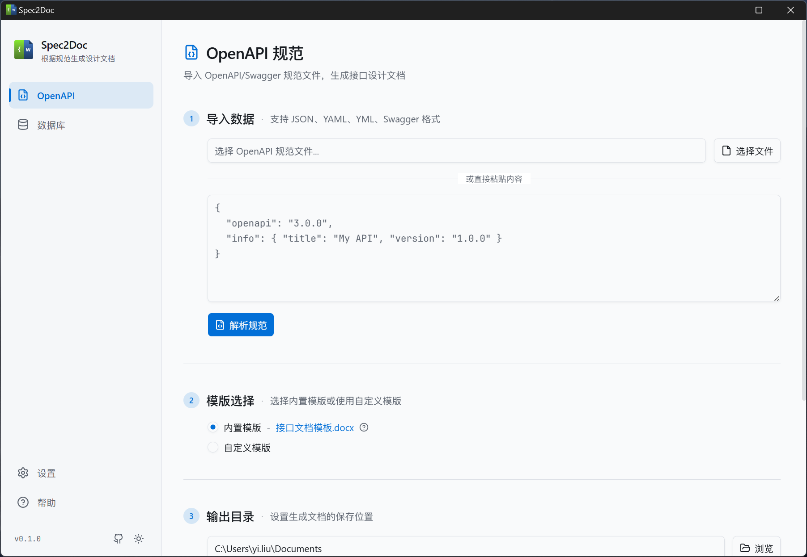
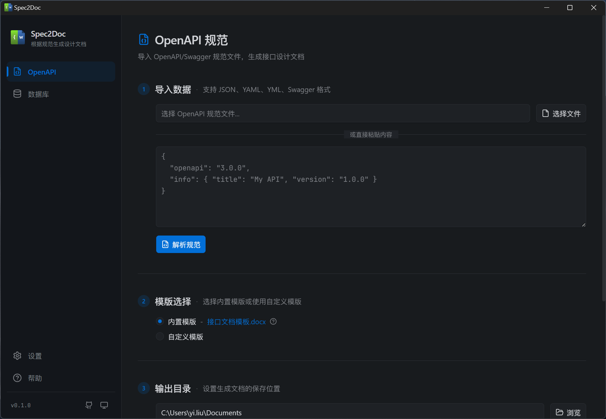

<p align="center">
  
</p>

<h1 align="center">Spec2Doc</h1>

<p align="center">
  将 OpenAPI 规范与数据库结构转换为标准化 Word 文档的桌面应用
</p>

<p align="center">
  <a href="https://github.com/LiLittleCat/spec2doc/releases/latest">
    
  </a>
  
  <a href="https://github.com/LiLittleCat/spec2doc/blob/main/LICENSE">
    
  </a>
</p>

## 截图

<table>
  <tr>
    <td></td>
    <td></td>
  </tr>
  <tr>
    <td align="center">浅色主题</td>
    <td align="center">深色主题</td>
  </tr>
</table>

## 主要功能

- **OpenAPI 文档生成**：导入 OpenAPI 规范（粘贴或选择 YAML/JSON 文件），自动解析并生成接口文档
- **数据库文档生成**：通过 DDL 导入或数据库连接（支持 SSH 隧道），解析表结构并生成数据库设计文档
- **模板驱动**：基于 docxtemplater，使用 .docx 模板生成文档，支持自定义模板
- **自动更新**：内置版本检查与自动升级功能
- **深色/浅色主题**：支持系统跟随、手动切换

## 下载安装

前往 [Releases](https://github.com/LiLittleCat/spec2doc/releases/latest) 下载对应平台的安装包：

| 平台 | 文件 |
|------|------|
| Windows | `.exe` (NSIS 安装包) |
| macOS (Apple Silicon + Intel) | `.dmg` |
| Linux | `.deb` / `.AppImage` |

## 技术栈

- **桌面框架**: Tauri 2 (Rust backend + WebView frontend)
- **前端**: React 19 + Vite 7 + TypeScript
- **样式**: Tailwind CSS v4 + shadcn/ui
- **解析**: @apidevtools/swagger-parser (OpenAPI), sql-ddl-to-json-schema (DDL)
- **文档生成**: docxtemplater + pizzip
- **代码质量**: Biome (lint + format), Vitest (test)

## 从源码构建

### 前置条件

- Node.js 18+（建议 20+）
- pnpm 10+
- Rust toolchain 与 Tauri 2 依赖（参考 [Tauri 官方文档](https://v2.tauri.app/start/prerequisites/)）

### 安装依赖

```bash
pnpm install
pnpm approve-builds
```

### 开发

```bash
# 仅前端预览（浏览器）
pnpm dev

# 完整桌面应用（推荐）
pnpm tauri dev
```

### 构建

```bash
pnpm tauri build
```

### 测试与代码检查

```bash
pnpm test          # 运行测试
pnpm lint          # 代码检查
pnpm format        # 代码格式化
```

## 发布流程

1. 更新 `CHANGELOG.md`、`package.json`、`src-tauri/tauri.conf.json` 和 `src-tauri/Cargo.toml` 中的版本号
2. 提交并推送代码
3. 创建并推送 tag：
   ```bash
   git tag v0.1.0
   git push origin v0.1.0
   ```
4. GitHub Actions 自动构建多平台安装包并创建 Release

## License

MIT
